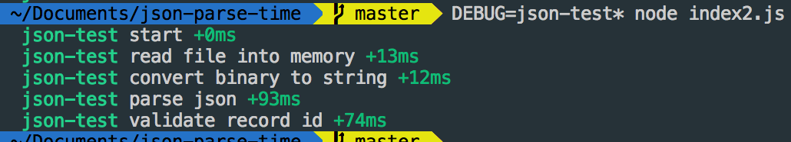
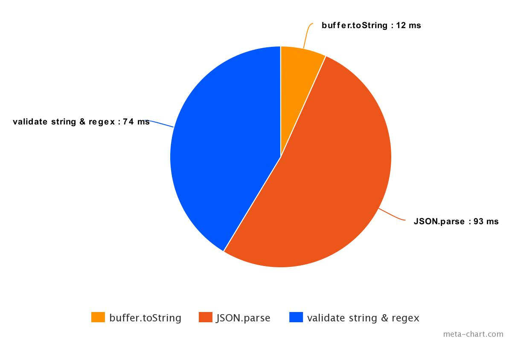

## install

```bash
npm install
```

## 只檢查是不是字串

```bash
DEBUG=json-test node index.js
```


## 還用 regexp 檢查

```js
const regex = /^(D|AP|NP|LN)\d{8}[a-zA-Z0-9]{6}$/
```

```bash
DEBUG=json-test node index2.js
```




